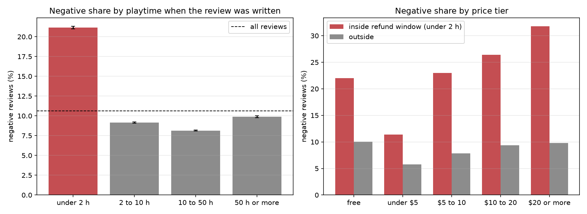
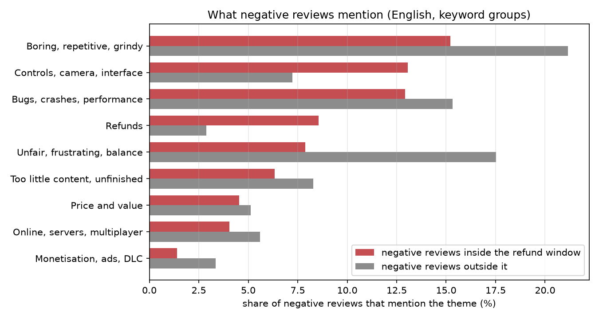

# Initial business findings

What the data says to a small indie studio or publisher deciding which feature combinations to back, what to fix before the
refund window closes, and when to patch. This is the first look for Review 1: **descriptive, not causal**. Every number
comes from `reports/results/findings_*.csv`, produced by `python -m src.analysis.business_findings`; the model numbers are
in `docs/model_comparison.md`. Data: 1,861 indie roguelike/roguelite games released 2022 to 2025 and 1,573,436 reviews of the
1,856 fully scraped ones.

## Headline findings

1. **The first two hours decide a lot.** Reviews written within 2 hours of play are negative **21.2%** of the time, against **8.8%** later. They are 14.5% of all reviews but **29.0% of all negative reviews**.
2. **The pricier the game, the harsher the early verdict.** Inside the refund window the negative share rises from 11.4% (games under $5) to 31.8% (games at $20 or more). Outside the window it stays between 5.8% and 10.0% at every price.
3. **Early complaints are about getting started; later complaints are about depth.** Negative reviews written inside the refund window mention controls, camera and interface almost twice as often (13.1% against 7.2%). Negative reviews written later mention repetitiveness (21.2% against 15.2%) and unfair difficulty (17.5% against 7.9%) far more.
4. **Store metadata says little about which games will struggle**, but a few launch signals go with it (below). The best game-level models reach a macro-F1 of about 0.42, against 0.22 for guessing: weak but real.
5. **Reading the review text is far more informative than any metadata**: detecting a negative review reaches a PR-AUC of 0.785 with the full text, against 0.360 without it (same English reviews).

## 1. The refund window

Steam lets a player refund a game within 14 days if they have played under 2 hours. We only observe the playtime (under 120
minutes when the review was written), so "inside the window" below means under 2 hours played.

| Playtime when the review was written | Reviews | Negative |
| --- | ---: | ---: |
| Under 2 hours | 228,899 | **21.2%** |
| 2 to 10 hours | 600,446 | 9.1% |
| 10 to 50 hours | 565,903 | 8.1% |
| 50 hours or more | 178,176 | 9.9% |

- **It is not just a few big games.** In 465 of 493 games with at least 50 reviews on each side (94.3%) the window is more negative, by a median of **13.1 percentage points**.
- **Price tier** (negative share of reviews written inside the window, with the share outside in brackets): free 22.0% (10.0%), under $5 11.4% (5.8%), $5 to 10 23.0% (7.9%), $10 to 20 26.4% (9.4%), $20 or more 31.8% (9.8%).
- **Launch week and Early Access** matter much less: 11.4% negative in the first 7 days against 10.5% later; 12.1% when written during Early Access against 10.2% after 1.0.
- **What this means:** a large part of the negative feedback arrives while the player can still get their money back, so it is lost revenue as well as a bad review. We cannot put a figure on the revenue: reviews are not purchases, and only 0.47% of reviews are marked as refunded.

## 2. What negative reviews mention

An initial, keyword-based look at 563,961 English reviews with analysable text (10.2% negative). Each theme is a group of
words (for example crash, lag, freeze, bug for the first); Review 2's topic modelling will replace it with something less crude.

| Theme | Share of reviews that mention it | Negative when mentioned | Share of negative reviews | Inside the window | Outside |
| --- | ---: | ---: | ---: | ---: | ---: |
| Boring, repetitive, grindy | 5.1% | 37.8% (3.7x the base) | 19.0% | 15.2% | 21.2% |
| Bugs, crashes, performance | 5.5% | 26.9% (2.6x) | 14.5% | 12.9% | 15.3% |
| Unfair, frustrating, balance | 4.6% | 31.0% (3.0x) | 14.0% | 7.9% | 17.5% |
| Controls, camera, interface | 3.4% | 28.1% (2.8x) | 9.3% | **13.1%** | 7.2% |
| Too little content, unfinished | 3.7% | 21.1% (2.1x) | 7.6% | 6.3% | 8.3% |
| Price and value | 0.8% | **66.2% (6.5x)** | 4.9% | 4.5% | 5.1% |
| Online, servers, multiplayer | 3.8% | 13.4% (1.3x) | 5.0% | 4.1% | 5.6% |
| Monetisation, ads, DLC | 1.2% | 21.6% (2.1x) | 2.6% | 1.4% | 3.3% |
| Refunds | 0.7% | 69.5% (6.8x) | 4.9% | 8.6% | 2.9% |
| Praise (control group: fun, addictive, love ...) | 45.2% | 7.7% (0.8x) | 34.2% | 25.2% | 39.3% |

- The praise group behaves as it should (negative only 7.7% of the time), which supports the method.
- **Price complaints are rare but nearly always negative** (66.2%): few players raise price, but those who do are unhappy.
- **Stability complaints are the same size inside and outside the window** (12.9% and 15.3%), so quality assurance before launch pays off in both phases.
- **Review length and language are the strongest metadata signals** (they top the SHAP ranking of the XGBoost model). Negativity rises steadily with length: 6.0% for reviews under 20 characters, 9.7% for 20 to 60, 11.8% for 60 to 200, 16.6% for 200 to 1,000 and 22.8% above 1,000. By language, simplified Chinese reviews are negative 13.3% of the time and traditional Chinese 12.3%, against 9.7% for English and Russian, and 4.2% for Brazilian Portuguese and 5.0% for Spanish (`findings_review_patterns.csv`).

## 3. What goes with struggling games

Games with at least 20 reviews are placed in one of three tiers (`docs/game_target.md`); "Struggling" means 30% or more of the reviews are
negative. The figures use the **1,191 training games only**, of which 13.9% are Struggling and 35.3% Strong.

| Characteristic | Games | Struggling | 95% interval |
| --- | ---: | ---: | --- |
| At least one DLC | 288 | **7.3%** | 4.8% to 10.9% |
| No DLC | 903 | 15.9% | 13.7% to 18.5% |
| Achievements listed | 966 | 12.5% | 10.6% to 14.8% |
| No achievements | 225 | **19.6%** | 14.9% to 25.2% |
| Full controller support | 488 | 11.5% | 8.9% to 14.6% |
| No controller support listed | 703 | 15.5% | 13.0% to 18.4% |
| Launched in Early Access | 236 | 17.4% | 13.1% to 22.7% |
| No Early Access phase | 955 | 13.0% | 11.0% to 15.3% |

- **Price does not predict struggling** (12.8% to 16.6% in every tier), but it does predict the top tier: games under $5 are Strong 44.1% of the time, games at $10 to 20 only 25.5%, and $20 or more 27.8%. Higher prices raise expectations.
- **Tags.** Struggling is least common among Comedy (1.8%, 56 games), Twin Stick Shooter (1.8%, 55), Old School (2.4%, 41), 2D Platformer (3.2%, 63) and Resource Management (4.0%, 75), and most common among Online Co-Op (26.6%, 64), Post-apocalyptic (26.2%, 61), Violent (25.5%, 47), Open World (25.0%, 40) and Action RPG (24.4%, 135). The base rate is 13.9%.
- **Read these with care.** 108 tags were compared with no correction for multiple testing, the intervals are wide (Online Co-Op: 17% to 39%), and a game's DLC count is a snapshot that can include post-launch additions, so "has DLC" may be a sign of success as much as a cause. Treat the tag results as hypotheses; the EDA notebook (section 11) tests tag pairs with a false-discovery-rate correction.

## 4. What the models add

- **Game level:** the models find the tier only weakly (macro-F1 about 0.42, 0.22 for guessing, and 0.14 to 0.45 of struggling games found depending on the model). Tag components carry nearly all the signal (0.412 alone, against 0.418 for all launch-time features), and the learning curve is flat, so more games would not help: a store page simply does not show how good a game is. The most important features in the XGBoost SHAP ranking are the tag components for a polished store page (cloud saves, controller support, achievements), roguelite and bullet-hell games, and 2D pixel games against 3D, plus the number of achievements.
- **Review level, metadata only:** a PR-AUC of about 0.28 against 0.106 for guessing. The top features are review length, language, playtime at review and the reviewer's number of reviews.
- **Review level with text:** 0.785 (ROC-AUC 0.955) against 0.360 without text, on English reviews. This detects negative reviews rather than forecasting them, so it is a tool for monitoring and triage: a studio can flag complaints as they arrive and see what they are about.

## 5. What a studio can do with this

Each point links to its evidence above; all are associations.

1. **Treat the first two hours as the product.** Fix the opening experience first: controls, camera and interface issues are over-represented in early negative reviews, and so are refund mentions. This matters most for games priced at $10 or more.
2. **Patch for depth after launch.** After the first two hours the complaints turn to repetition and balance, so content and balance patches protect the reviews of players who stay.
3. **Test for stability before launch.** Bugs, crashes and performance appear in 13% to 15% of negative reviews in both phases.
4. **Match price to what the first hour delivers.** Higher-priced games receive harsher early reviews and are less often rated Strong.
5. **Be wary of scope.** Online co-op, open-world and action-RPG games struggle more often in this sample than small, focused ones (comedy, twin-stick shooters, 2D platformers); a small team has less margin for a large scope.
6. **Basics help.** Games that list achievements and controller support struggle less often, which is cheap to copy.
7. **Read the reviews with a tool.** Text models separate negative reviews well (PR-AUC 0.79); a studio can use them to find and group complaints automatically.

## 6. Limits and next steps

- **Associations, not causes.** A studio cannot conclude from this that adding DLC prevents struggling.
- **Snapshots.** Prices, tags and DLC are as of 1 October 2026, not as of launch; tiers use review totals on that date, and older games have had longer to collect negative reviews.
- **Five very large games** (Megabonk, Cult of the Lamb, Hades II, Balatro, Vampire Survivors) are left out of the review-level figures because only their newest reviews were collected.
- **The theme analysis is keyword-based** and English only; non-English reviews (about 60%) are not covered.
- **Review 2** adds association rules on tags, price and Early Access, topic modelling of complaints with a manual check, and the patch-impact analysis (before and after patches and discounts), which will answer "when to patch" properly.
