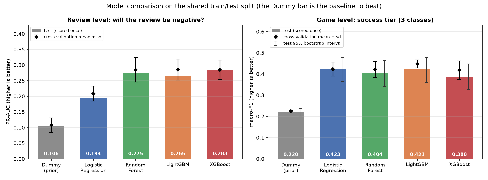

# Model comparison

Generated by `python -m src.models.compare` from `reports/results/`. Every model uses the same features, the shared
train/test split by game and the same 5 cross-validation folds (`docs/modelling_protocol.md`); the test set was scored once.
The Dummy row is the baseline to beat.

## Review level: will the review be negative? (1,257,095 training / 316,341 test reviews)

| Model | Settings | CV PR-AUC (mean ± sd) | Test PR-AUC | Test ROC-AUC | Per-game ROC-AUC | Precision / recall / F1 at the CV threshold |
| --- | ---: | ---: | ---: | ---: | ---: | ---: |
| Dummy (prior) | default settings | 0.107 ± 0.024 | 0.106 | 0.500 | 0.500 | 0.11 / 1.00 / 0.19 |
| Logistic Regression | tuned | 0.208 ± 0.024 | 0.194 | 0.663 | 0.684 | 0.20 / 0.43 / 0.27 |
| Random Forest | tuned | 0.285 ± 0.040 | 0.275 | 0.721 | 0.745 | 0.23 / 0.50 / 0.31 |
| LightGBM | tuned | 0.285 ± 0.034 | 0.265 | 0.729 | 0.744 | 0.23 / 0.53 / 0.32 |
| XGBoost | default settings | 0.285 ± 0.031 | 0.283 | 0.733 | 0.743 | 0.24 / 0.52 / 0.33 |

## Game level: success tier (1,191 training / 299 test games)

| Model | Settings | CV macro-F1 (mean ± sd) | Test macro-F1 [95% interval] | Test balanced accuracy | Recall: Struggling / Solid / Strong | AUC Struggling vs rest | With tuned class scales: macro-F1 / Struggling recall |
| --- | ---: | ---: | ---: | ---: | ---: | ---: | ---: |
| Dummy (prior) | default settings | 0.225 ± 0.003 | 0.220 [0.20, 0.24] | 0.333 | 0.00 / 1.00 / 0.00 | 0.500 | 0.220 / 0.00 |
| Logistic Regression | tuned | 0.422 ± 0.033 | 0.423 [0.36, 0.48] | 0.439 | 0.39 / 0.40 / 0.52 | 0.644 | 0.440 / 0.45 |
| Random Forest | tuned | 0.421 ± 0.038 | 0.404 [0.34, 0.46] | 0.405 | 0.14 / 0.57 / 0.50 | 0.682 | 0.417 / 0.24 |
| LightGBM | tuned | 0.447 ± 0.019 | 0.421 [0.36, 0.48] | 0.444 | 0.45 / 0.37 / 0.51 | 0.648 | 0.421 / 0.45 |
| XGBoost | default settings | 0.418 ± 0.044 | 0.388 [0.33, 0.45] | 0.390 | 0.14 / 0.56 / 0.48 | 0.629 | 0.404 / 0.22 |

## How to read these results

- **Review level.** The three tree-based models are about equal: test PR-AUC 0.265 to 0.283 and ROC-AUC 0.72 to 0.73, about 2.5 times the 0.106 you get by guessing. The differences between them are smaller than the fold-to-fold spread (sd 0.03 to 0.04), so none of them can be called the best. **Logistic Regression is clearly weaker** (0.194), which says negativity depends on non-linear patterns, for example review length together with playtime. Every model beats the Dummy baseline.
- **Game level.** All four real models beat the Dummy baseline (macro-F1 0.22) by 0.17 to 0.20, and **the simple models do at least as well as the boosted ones**: Logistic Regression 0.423, LightGBM 0.421, Random Forest 0.404, XGBoost 0.388. The test intervals overlap completely (299 test games, only 51 of them Struggling), so again no winner. With about 1,200 training games, extra model complexity does not help.
- **Struggling games are the hard part, and the models trade off differently.** At the default decision rule, Random Forest and XGBoost find only 14% of Struggling games but 56 to 57% of Solid ones. Logistic Regression and LightGBM, which weight rare classes more, find 39 to 45% of Struggling games and give up Solid recall (37 to 40%). Which is better is a business choice: missing a struggling launch is probably costlier than a false alarm.

## Caveats

- **XGBoost uses its default settings** and was run by M4 in an earlier environment. The other models were tuned on cross-validation (a small grid; for the review level on a 25% sample of training games). Tuning did not clearly help: untuned LightGBM scored 0.277 on the review test set against 0.265 tuned. Running `python -m src.models.review_xgboost --tune 10` and `python -m src.models.game_xgboost --tune 20` would put XGBoost on the same footing.
- **Cross-validation is slightly optimistic** (early stopping and tuning choose settings on the validation folds), for example LightGBM at game level: 0.447 in cross-validation against 0.421 on test. Quote the test numbers and their intervals.
- **Re-running gives slightly different numbers** (about 0.01 at game level), because of library versions and threading.
- **These models explain; they are not all launch-time scorers.** The game-level models use launch-time features only. The review-level models use review text length, playtime and similar features that only exist after a review is written (see `docs/modelling_protocol.md`).
- Results files: `reports/results/{review,game}_<model>.csv`; run the models with `python -m src.models.review_models` and `python -m src.models.game_models`, then `python -m src.models.compare`.
